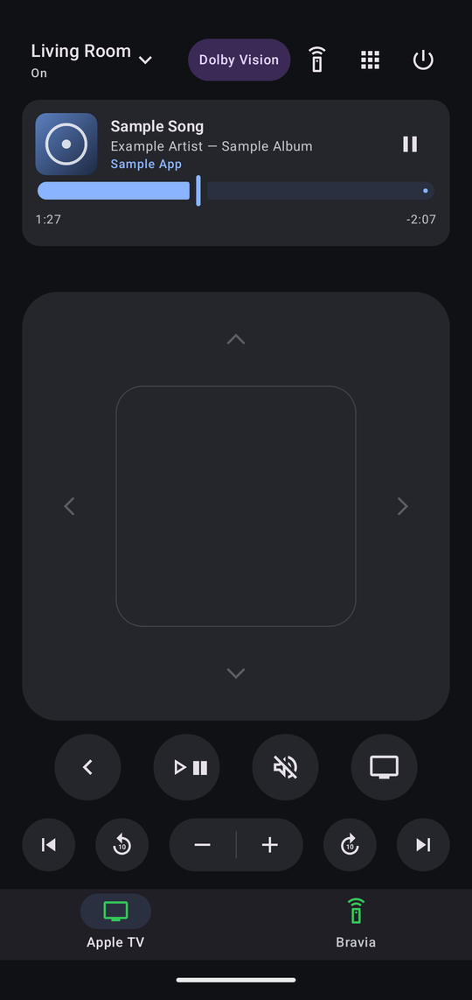
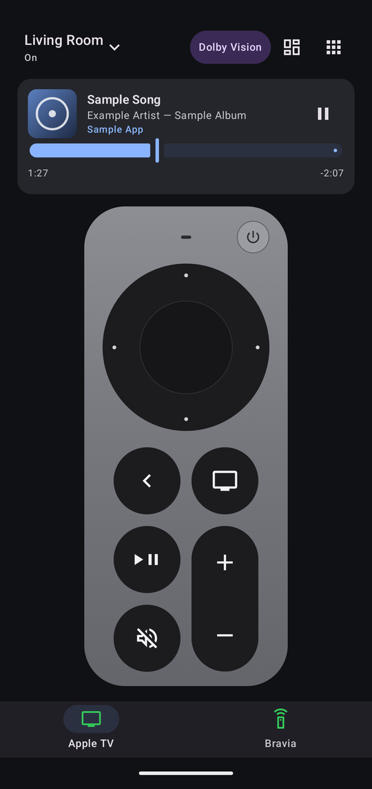
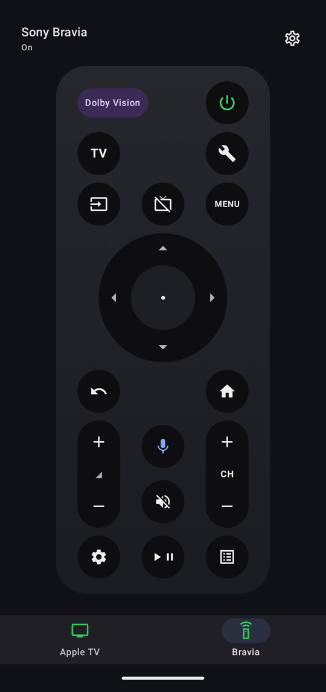
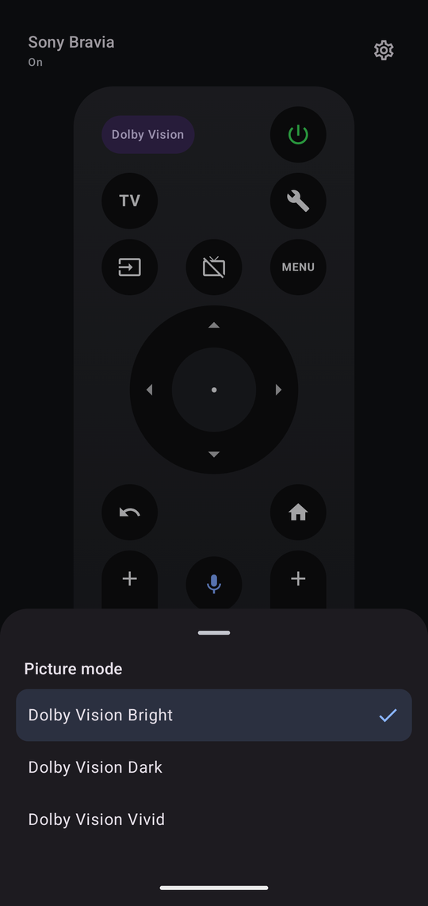

# ATV Remote - [Download (v1.0.0)](https://github.com/jameskho512/atv-remote/releases/download/v1.0.0/atv-remote-1.0.0.apk)

An Android remote for Apple TV and Sony TVs. It talks to your devices directly over your home network, with no account, ads, or analytics.

> **Unofficial project.** Not affiliated with or endorsed by Apple or Sony. See [Disclaimer](#disclaimer).  
> I built this for my own Apple TV and a Sony Bravia 8 II, and that's all I've tested it on. Other Sony TVs with `IP Control` should work, but this isn't guaranteed. Other brands use different protocols and aren't supported. Issues and pull requests are welcome.

<p align="center">
  
  
  
  
</p>

## Features

**Apple TV tab**
- Touchpad: swipe to move around, tap to select, touch and hold for a long press. Touching the edges presses the arrow buttons.
- An optional layout that shows a virtual Remote.
- Back, Home, Play/Pause, Mute, volume, 10-second skip forward and back, previous and next track.
- App launcher, and typing into the TV's text fields from your phone's keyboard, which opens by itself when the TV selects a text field.
- A now-playing card with artwork and a scrub bar for seeking, and a media notification in the notification drawer.
- Power: tap to wake the Apple TV, hold for half a second to put it to sleep. A circle grows around your thumb while you hold.
- The phone's volume keys control the TV.

**Sony Bravia tab** (over Sony's IP control; optional, hidden until you add a TV)
- Power (tap to turn on, hold for a Restart / Turn off menu), TV, Input, Menu, Back, Home, a d-pad you can also swipe, volume, channel, Mute, Play/Pause, Settings, Guide and Google Assistant.
- A picture-off toggle (screen off, sound on) and a badge that shows whether the TV is in Dolby Vision, HDR, or SDR. Tap the badge to pick a picture mode. The badge also shows on the Apple TV pages when a Bravia is set up.
- Each tab's icon turns green while its device is on.

## Setting up

### Apple TV

1. Put your phone on the same Wi-Fi network as the Apple TV and open the app. Apple TVs on your network appear in the list (or use **Add by IP address**).
2. Tap your Apple TV and enter the PIN it shows on the TV.
3. Mute and the now-playing card may need a second pairing ("See what's playing"). If the app asks, enter the code shown on the TV. Without it, those two features won't work.

### Sony Bravia

On the TV, open the network settings and turn on IP control (menu names vary by model, roughly *Settings > Network & Internet > Home network setup > IP control*):

- Authentication: **Normal and Pre-Shared Key**
- Pre-Shared Key: choose a key
- Simple IP control: **on**
- Remote start: **on**, if you want the app to turn the TV on from standby

Then, on the app's device list, tap **Add Sony Remote**, enter the TV's IP address and the pre-shared key, and tap **Connect**. A **Bravia** tab appears once a TV has been added.

## Privacy and security

- Pairing keys (Apple TV) and the Bravia pre-shared key are stored unencrypted in the app's private storage on your phone.
- Sony's IP control uses plain HTTP, so the Bravia key is sent unencrypted over your network.

## Building

You need JDK 17 and the Android SDK (put `sdk.dir=<path to your SDK>` in a `local.properties` file). The app runs on Android 8.0 or newer.

```bash
./gradlew assembleDebug        # Windows: gradlew.bat assembleDebug, or build.bat
adb install -r app/build/outputs/apk/debug/app-debug.apk
```

## Disclaimer

- ATV Remote is an unofficial project. It is not affiliated with or endorsed by Apple Inc., Sony Group Corporation, or Dolby Laboratories. Apple, Apple TV, Siri, and tvOS are trademarks of Apple Inc.; Sony and BRAVIA are trademarks of Sony Group Corporation; Dolby Vision is a trademark of Dolby Laboratories. They are used here only to describe which devices the app works with.
- The app uses network protocols that the open-source community worked out for Apple devices (mainly [pyatv](https://github.com/postlund/pyatv)) and that Sony documents publicly for Bravia TVs. None of Apple's or Sony's code, images, or other material is included. Either company could change its protocol and break the app.
- Use at your own risk. The software is provided "as is", without warranty of any kind.

## Licence

Released under the [GNU General Public License v3.0](LICENSE). Parts follow [pyatv](https://github.com/postlund/pyatv) (MIT); see [NOTICE.md](NOTICE.md) for that and other third-party licences. The GPL does not grant any rights to Apple's, Sony's, or Dolby's trademarks.

<a href="https://www.buymeacoffee.com/j.ho"></a>
